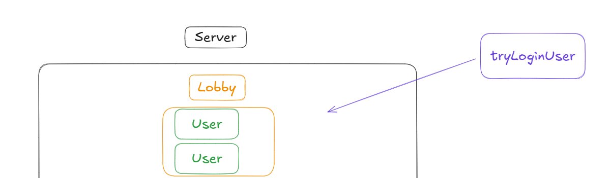

## 클래스 모델링

IRC 클라이언트는 채널에 입장할 수 있고, 그 안에서 유저들끼리 채팅이 가능해야 합니다.  

그에 따른 서버 로직을 처리하기 위해 클래스 모델링을 했습니다.  

 
    
모델링 발달 과정 1

서버 및 다수의 채널과 다수의 유저 포함하기 위해 아래와 같은 구조를 만들었습니다.  

  
  

 
 

그러나, 이 구조는 유저가 채팅 채널에서 나갔을 때 문제가 됩니다.
유저의 메모리를 어디에 보관해야 합니다. 서버에서 보관해도 되지만, 채널을 조금 더 일반화 시킨다면 더 나은 구조가 되어보입니다.

아래와 같이 Space를 추상화 하여 부모클래스로 만들고, Lobby를 따로 추가했습니다.

채널에서 나가게 되면 Lobby에 입장하게 되고, 기능이 제한됩니다.  

  
  

  

 
    
모델링 발달 과정 2

아래 왼쪽 그림처럼 유저가 로그인을 시도하려고 합니다.  
이때 패스워드나 올바른 닉네임인지, 중복이 있는지 확인을 해야합니다.  Lobby에서 처리하는 것은 상식적으로 올바르지 않다고 판단했습니다.  

이에 따라 오른쪽 그림처럼 loginSpace를 따로 만들었습니다. 

  
  

이후 필요한 메서드들을 추가했습니다.  

  

아래와 같은 구조를 같게 된 이유는 [DETAIL_3_PROTOCOL_AND_COMMAND](../docs/DETAIL_3_PROTOCOL_AND_COMMAND.md)와도 밀접한 관련이 있습니다.  

중간 결과  

