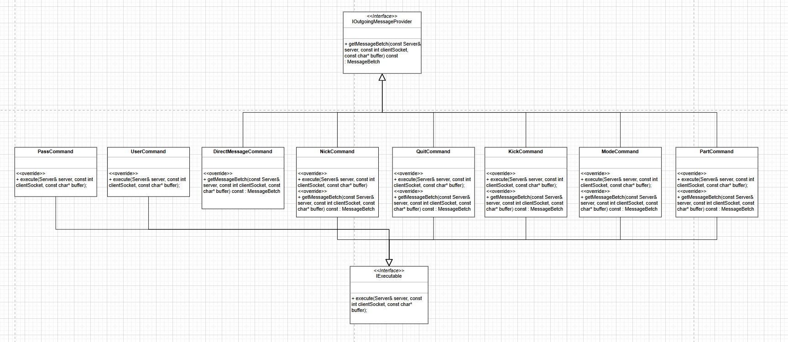

## 프로토콜

irc 클라이언트를 호환하기 위해서 irc 프로토콜로 처리해야 합니다.  
RFC 문서 [2811](https://datatracker.ietf.org/doc/html/rfc2811), [2812](https://datatracker.ietf.org/doc/html/rfc2812)  과 함께 irssi와 상용 irc 서버를 연결하고 tcpflow를 실행해보면서 세그먼트가 어떻게 주고받는지 확인했습니다. 

    
 irc 프로토콜 예시

#PRIVMSG < ChannelName >    
#PRIVMSG < Nickname >  
#JOIN < ChannelName >  
#QUIT  
#PART  
 
tcpflow로 확인한 세그먼트  
127.000.000.001.52636-127.000.000.001.06667: PRIVMSG #aaa :helloworldaaaaaaaaaaaaaaaaaaaaaaaaa  
127.000.000.001.06667-127.000.000.001.47094: :sejjeong!root@127.0.0.1 PRIVMSG #aaa :helloworldaaaaaaaaaaaaaaaaaaaaaaaaa

  
  
  
    

## 커맨드

기본적으로 구현해야 하는 명령어는 아래와 같습니다.  
로그인 관련 : PASS, NICK, USER  
채널 관련 : PART, QUIT, JOIN, TOPIC, MODE, KICK, INVITE, PRIVMSG  

필요한 명령어 외에도 다른 명령어가 추가될 여지가 높아보였습니다. (실제로 로그인 관련 명령어는 중간에 알게 되었습니다) 일반화를 하기로 결정합니다. 명령어의 행동 양상을 분석해보니, <mark>**클라이언트에게 메시지를 전송 또는 어떤 로직을 처리 또는 모두 필요**</mark> 했습니다.  

양상이 다를 땐, 하나의 부모 클래스보단 인터페이스를 나눠 사용하는 것이 적합합니다.  

IOutgoingMessageProvider와 IExecutable을 만들어 해당되는 클래스에게 상속했습니다.  

명령어를 추가 해도 <mark>**실행부는 바뀌지 않고**</mark>, 매핑만 해주면 됩니다.  
이후 팀원들과 명령어를 분배하고 병렬적으로 구현했습니다.  

 
    
 실행부 및 채널 매핑 코드 

https://github.com/SeJin0214/IRCServer/blob/3274f7e8b6a36168284eaf8812ca7fcb171f4363/core/Server.cpp#L497-L518
https://github.com/SeJin0214/IRCServer/blob/3274f7e8b6a36168284eaf8812ca7fcb171f4363/core/Channel.cpp#L141-L162
     

  
 

유저가 몸담고 있는 Space에 따라 사용 가능한 명령어 집합이 다르기에,  Space마다 다른 명령어를 반환하도록 구현했습니다.  

 
    
 LoginSpace 매핑 코드 

https://github.com/SeJin0214/IRCServer/blob/3274f7e8b6a36168284eaf8812ca7fcb171f4363/core/LoggedInSpace.cpp#L42-L59
     

  
 

이전에 봤던 실행부 코드에서 IOutgoiongMessageProvider와 IExecutable을 찾기 전에 space를 찾는 함수를 실행해줍니다.  

 
    
 call stack findSpace 

https://github.com/SeJin0214/IRCServer/blob/3274f7e8b6a36168284eaf8812ca7fcb171f4363/core/Server.cpp#L497

유저가 속한 Space를 찾습니다.  
https://github.com/SeJin0214/IRCServer/blob/3274f7e8b6a36168284eaf8812ca7fcb171f4363/core/Server.cpp#L184-L196

getSpace는 Lobby, LoginSpace, Channel을 담아서 줍니다.  
https://github.com/SeJin0214/IRCServer/blob/3274f7e8b6a36168284eaf8812ca7fcb171f4363/core/Server.cpp#L109

 

  
  

